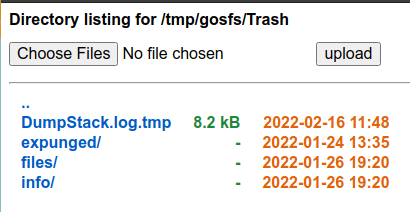

<div align="center">
	<h1>Golang SFS (Golang simple file server)</h1>
	<blockquote align="center">Github repository template for Go to quickly create a new repository.</blockquote>
	<p>
		<a href="https://github.com/ntk148v/gosfs/blob/master/LICENSE">
			
		</a>
		<a href="https://github.com/ntk148v/gosfs/stargazers">
			
		</a>
		<br>
<!--		<a href="https://github.com/ntk148v/gosfs/actions">
			
		</a>
		<a href="https://github.com/ntk148v/gosfs/actions">
			
		</a>
		<a href="https://github.com/ntk148v/gosfs/actions">
			
		</a>
		<br>-->
	</p><br>
</div>

Simple HTTP server written in pure Golang to serve and upload files.

## Getting started

```bash
$ go run main.go --help
Usage of /tmp/go-build2896055445/b001/exe/main:
  -bind-addr string
        IP address to bind (default "0.0.0.0")
  -max-size int
        max size of uploaded file (byte) (default 5242880)
  -port int
        port number to listen on (default 2690)
  -root-dir string
        root directory (default "/tmp/gosfs")
```

### TODO

- Multiple upload

## Screenshots


